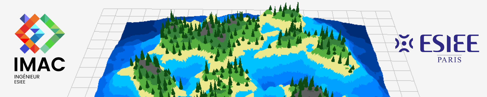

Matthieu FARANDJIS, Nils MOREAU--THOMAS

# Sommaire

- [Sommaire](#sommaire)
- [I - Plateformes et structure](#i---plateformes-et-structure)
    - [Plateformes](#plateformes)
    - [Structure](#structure)
- [II - Liste des tâches](#ii---liste-des-tâches)
- [III - Informations supplémentaires](#iii---informations-supplémentaires)
- [IV - Choix algorithmiques](#iv---choix-algorithmiques)
    - [Color map](#color-map)
    - [Masque](#masque)
    - [ImGui local](#imgui-local)
    - [Poisson disk sampling](#poisson-disk-sampling)
- [V - Paramètres et impact visuel](#v---paramètres-et-impact-visuel)
    - [Color map](#color-map-1)
    - [Aléatoire](#aléatoire)
    - [Intervalle de spawn](#intervalle-de-spawn)
    - [Bruit fractal](#bruit-fractal)
    - [Poisson disk sampling](#poisson-disk-sampling-1)
- [VI - Difficultés et solutions](#vi---difficultés-et-solutions)
    - [Le Simplex qui fonctionnait mal](#le-simplex-qui-fonctionnait-mal)
        - [Le problème](#le-problème)
        - [La solution](#la-solution)
    - [Les objets qui se déplaçaient aléatoirement](#les-objets-qui-se-déplaçaient-aléatoirement)
        - [Le problème](#le-problème-1)
        - [La solution](#la-solution-1)
    - [Interface ergonomique](#interface-ergonomique)
        - [Le problème](#le-problème-2)
        - [La solution](#la-solution-2)
    - [L'échec du Diamond Square et des bruits matriciels](#léchec-du-diamond-square-et-des-bruits-matriciels)
        - [Avant](#avant)
        - [Le problème](#le-problème-3)
        - [La solution](#la-solution-3)
        - [Problèmes résultant](#problèmes-résultant)
    - [Poisson Disk Sampling](#poisson-disk-sampling-2)
        - [Le 1er problème](#le-1er-problème)
        - [La 1ère solution](#la-1ère-solution)
        - [Le 2ème problème](#le-2ème-problème)
        - [La 2ème solution](#la-2ème-solution)
        - [Le 3ème problème](#le-3ème-problème)
        - [La 3ème solution](#la-3ème-solution)
- [VII - Captures d'écrans comparatives](#vii---captures-décrans-comparatives)
- [VIII - Post-mortem](#viii---post-mortem)
    - [Les problèmes et les résolutions](#les-problèmes-et-les-résolutions)
    - [Avec plus de temps](#avec-plus-de-temps)
    - [Répartition du travail](#répartition-du-travail)

# I - Plateformes et structure

## Plateformes

Le projet a été développé sur Windows et Linux (Ubuntu) à l'aide de Microsoft Visual Studio Code et de Jetbrains CLion.

Environnements de développement

- Matthieu
    - Ubuntu 24.04.4 LTS 64 bits
        - CLion
    - Microsoft Windows 11 Home 25H2 (26200.8457) 64 bits
        - CLion 2025.2.3 (Build #CL-252.26830.83)
    - CPU : AMD Ryzen 5 7535HS
    - RAM : 16 Go
    - GPU : NVIDIA GeForce RTX 4050 Laptop GPU (6 Go)

- Nils
    - Microsoft Windows 11 (26200.8524) 64 bits
        - Visual Studio Code
    - CPU : Intel Core i7-11800H 11ème gen (2.30 GHz)
    - RAM : 64 Go
    - GPU1 : NVIDIA GeForce RTX 3060 Laptop GPU (6 Go)
    - GPU2 : Intel(R) UHD Graphics (128 Mo)

## Structure

```
├─── 📁 bin : exécutables
├─── 📁 build : fichiers de compilation
├─── 📁 img : images du rapport
├─── 📁 imgui : librairie d'interface, en local
├─── 📁 img : ressources, comme les images de color map
└─── 📁 src : code source
    ├─── 📁 utils : dossier avec les utilitaires
    ├─── 📄 app : fichiers avec les paramètres de l'application
    ├─── 📄 draw : fichiers de rendu d'interfaces et de la carte
    ├─── 📄 generation : fichiers de génération du terrain et des objets
    ├─── 📄 main.cpp : fichier d'exécution principal
    └─── 📄 noise : fichiers pour la génération des bruits
```

# II - Liste des tâches

> 🚧 : En cours ✅ : Fini ❌ : À faire
> ♒ : Amélioration supplémentaire ☑️ : Amélioration de l'énoncé

| Fait | Catégorie | En + | Tâche                                                               | Note | Qui      |
| ---- | --------- | ---- | ------------------------------------------------------------------- | ---- | -------- |
| ✅   | -         |      | Bruit fractal (FBM)                                                 |      | Matthieu |
| ✅   | -         |      | Générer heightmap + couleur                                         |      | Nils     |
| ✅   | -         |      | Poisson disk sampling (2D) + placement en 3D                        |      | Matthieu |
| ✅   | 🖥️ IHM    |      | Regénérer la heightmap                                              |      | Nils     |
| ✅   | 🖥️ IHM    |      | Regénérer le mesh 3D                                                |      | Nils     |
| ✅   | 🖥️ IHM    |      | Regénérer le poisson disk sampling                                  |      | Matthieu |
| ✅   | 🖥️ IHM    |      | Paramètres (seed, size, height range)                               |      | Nils     |
| ❌   | -         | ☑️   | Colormap builder                                                    |      | -        |
| ❌   | -         | ☑️   | Coloration avancé (ex: en fonction de la pente, type de biome, etc) |      | -        |
| ✅   | -         | ☑️   | Algorithmes différents bruit (Simplex, Worley, etc)                 |      | Nils     |
| ✅   | -         | ☑️   | Pile d'Algorithmes de bruit                                         |      | Nils     |
| ✅   | -         | ☑️   | Variation placement d'objet (taille, rotation)                      |      | Nils     |
| ✅   | -         | ☑️   | Placement d'objet avec des conditions (pentes, hauteur)             |      | Nils     |
| ❌   | -         | ☑️   | Importer un modèle 3D (libre de droits) à la place du cube          |      | -        |
| ❌   | -         | ☑️   | Liste de modèles 3D (libre de droits) à placer avec conditions      |      | -        |
| ❌   | -         | ☑️   | Biomes (colormap, liste d'objets, influence sur la hauteur, bruit)  |      | -        |
| ❌   | -         | ☑️   | Connecter les îles avec des ponts, ou par la terre                  |      | -        |
| ❌   | -         | ☑️   | Génération de différentes formes d'îles (au moins 3)                |      | -        |

# III - Informations supplémentaires

Il est recommandé d'utiliser l'extension `VS Code` [Todo Tree](https://marketplace.visualstudio.com/items?itemName=Gruntfuggly.todo-tree)

> ℹ️ : Avec `NOTE:` et `SOURCE:` d'ajoutée dans [todo-tree.general.tags](vscode://settings/todo-tree.general.tags)

Il est aussi recommandé d'utiliser l'`Outline` dans le panneau de droite de `VS Code`.

# IV - Choix algorithmiques

## Color map

Pour la coloration de la carte, J'ai (Nils) décidé de faire une color map (palette de coloration) d'après une image comme pour le [⭐⭐⭐⭐⭐⭐ Diamond Square](https://github.com/NilsMT/imac-wk-prog-algo-1/blob/main/EXOS.md#-diamond-square) pendant le Workshop de Prog Algo 1 qui mappe une valeur de la heightmap (0-1) à un pixel de la color map :


avec une interpolation linéaire (qui peut se désactiver) si la valeur ne correspond pas parfaitement à un pixel

| Avec                                 | Sans                               |
| ------------------------------------ | ---------------------------------- |
| 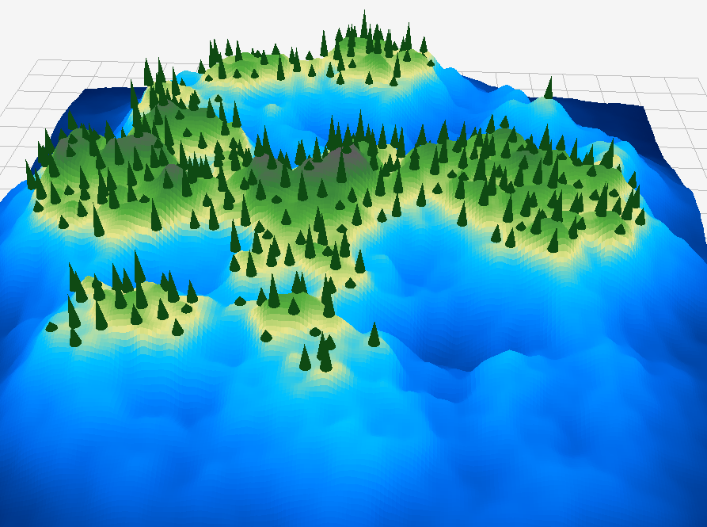 | 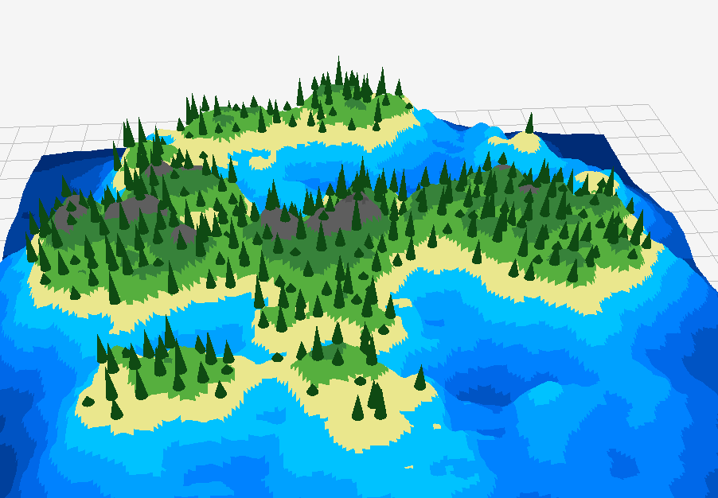 |

## Masque

Un masque sélectionnable a été choisi pour générer une île de manière personnalisable, le meilleur masque restant quand même Gaussien (pour avoir une forme circulaire).

Cela a été décidé car nous avions plusieurs bruits à disposition alors pourquoi pas en faire une fonctionnalité pour à la fois la pile de bruit et le masque.

Bien que cela ne soit que très peu utile.

## ImGui local

La librairie ImGui est stocké en local car, il y avait besoin d'un objet d'interface [slider-range2](https://github.com/Entrpi/imgui/tree/feature/slider-range2) qui n'était pas disponible mais déjà développé par quelqu'un.

La conséquence c'est que le projet est un plus gros en taille.

> (PS: le fetch-content dans le CMake ne marchait pas sur ce repo pour une raison obscure).

## Poisson disk sampling

Concernant le Poisson disk sampling, Matthieu avais commencé à créer une version sans tableau (qui n'est donc pas la version de Bridson's).<br>
Seulement, la version avec tableau (version de Bridson's) permet à l'algorithme de s'exécuter plus rapidement, c'est la version la plus populaire et la plus recommander, alors Matthieu a fini par l'implémenter (sachant qu'elle est demandé dans le sujet du projet).

# V - Paramètres et impact visuel

## Color map

Comme dit précédement, il a été choisi de permettre une sélection de la palette de couleur de la carte (et il est facile d'en ajouter une) pour avoir plusieurs types de "biomes".

Résultat : plusieurs visages pour une même île

| cm_mesa_32                         | cm_island_16                         | cm_elevation_16                         |
| ---------------------------------- | ------------------------------------ | --------------------------------------- |
| 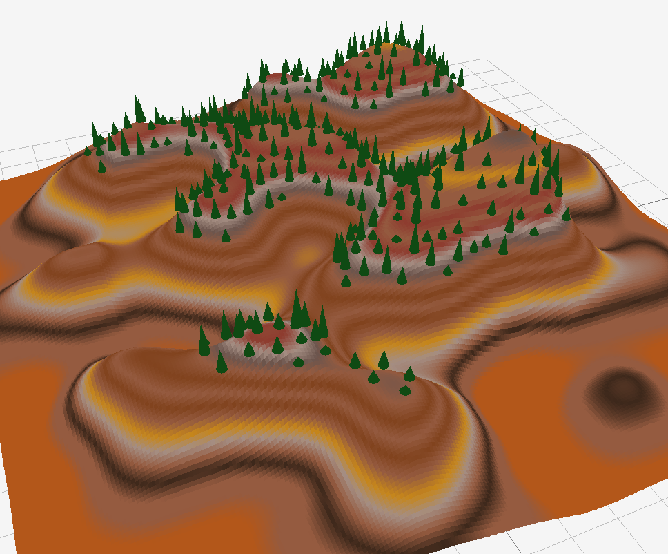 | 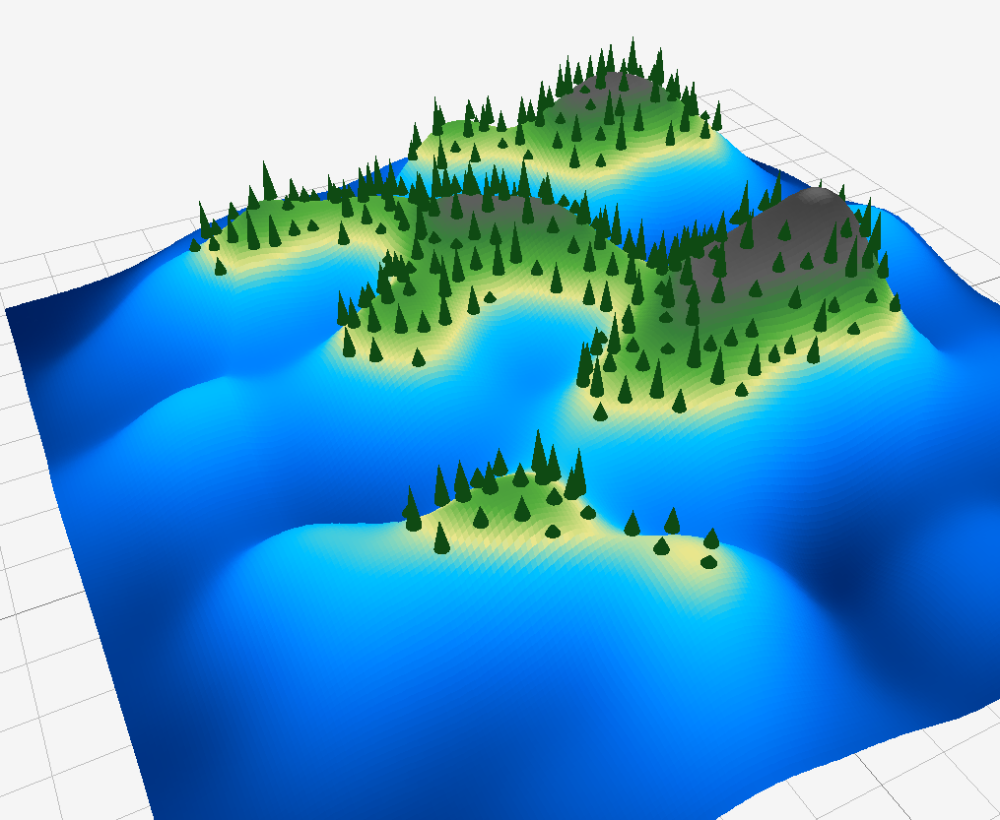 | 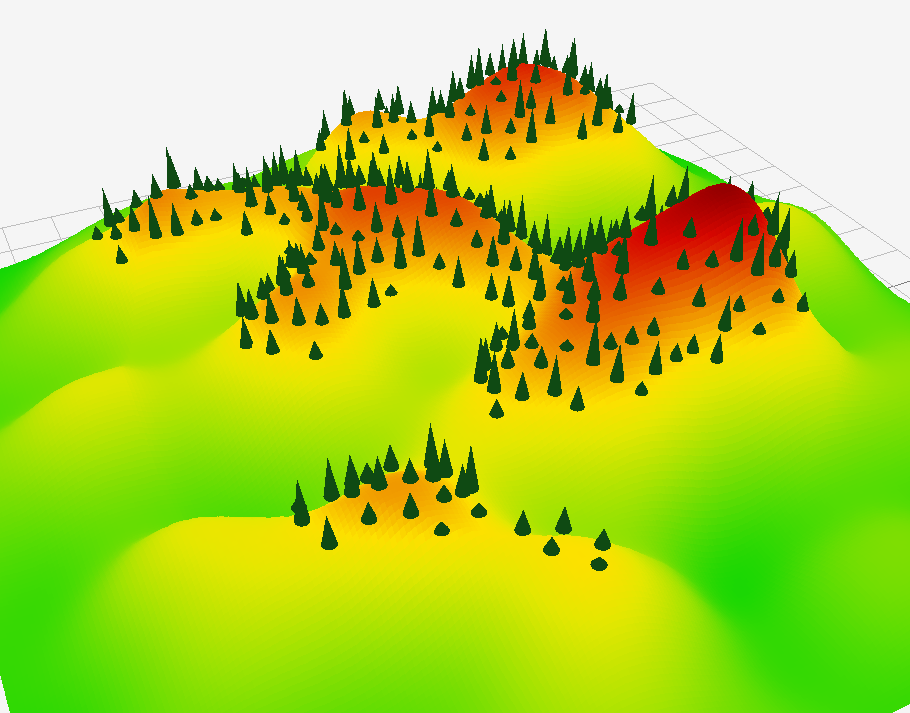 |

> Fun fact : les color map ont un chiffre à la fin de leurs nom qui correspond à la largeur de l'image (donc `cm_mesa_32` à un plus grande palette de couleur que `cm_island_16`)

## Aléatoire

Des paramètres ont été ajoutés pour faire varier la taille et l'orientation des objets placés, ce qui rend le rendu plus naturel.

| Avec                                   | Sans                                 |
| -------------------------------------- | ------------------------------------ |
| 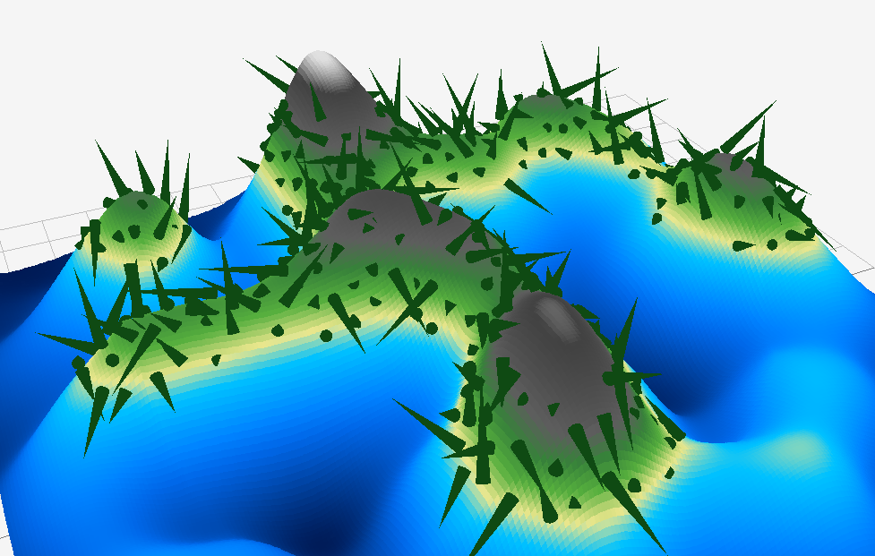 | 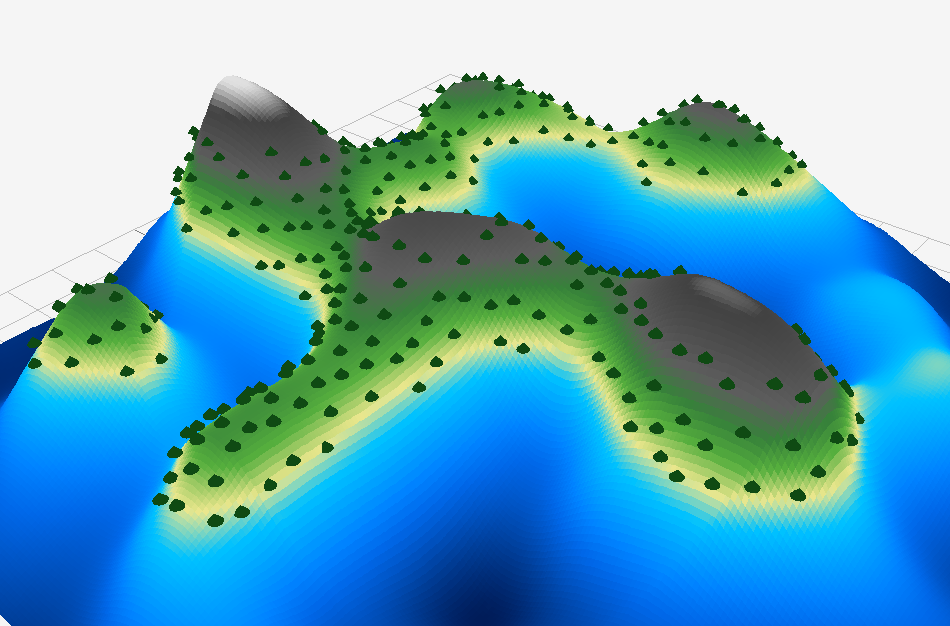 |

## Intervalle de spawn

Un intervalle de hauteur de spawn a été intégré pour conditionner le placement des objets et éviter, par exemple, les objets trop hauts dans les montagnes ou en mer.

| Avec                                       | Sans                                     |
| ------------------------------------------ | ---------------------------------------- |
| 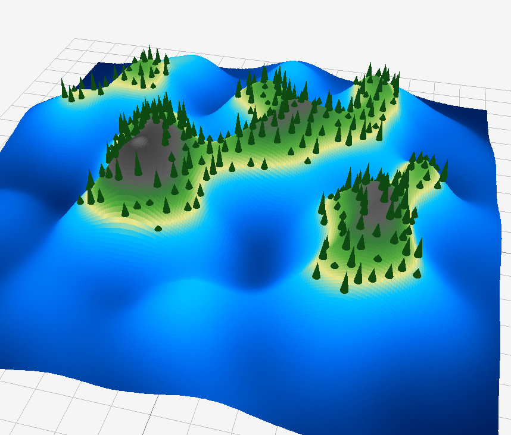 | 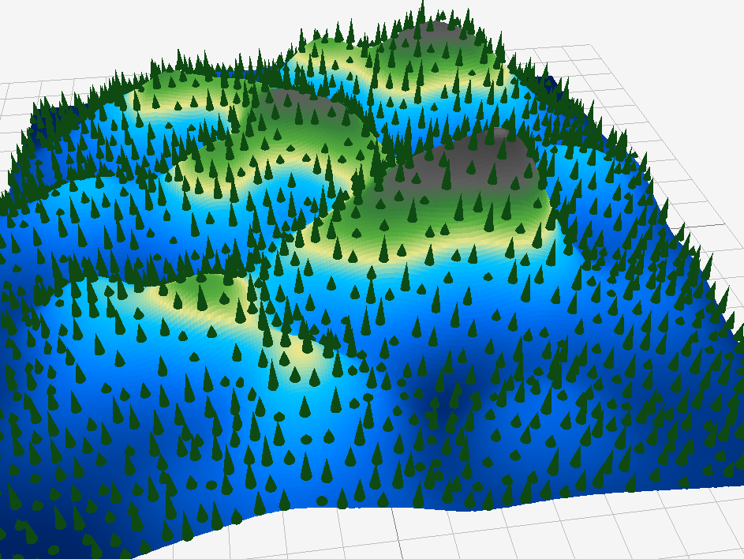 |

## Bruit fractal

Les paramètres du bruit fractal sont complexes.

Selon l'article https://thebookofshaders.com/13/?lan=fr :

_En ajoutant différentes itérations du bruit (différentes octaves), dont on augmente la fréquence (la lacunarité) et dont on réduit l'amplitude (le gain), on obtient une granularité qui permet de préserver les détails fins d'un bruit._

Un nombre de 6 octaves a été retenu comme un compromis entre détail et temps de génération.

La valeur peut être diminuée pour observer des différences, mais au-delà d'un certain niveau, les variations deviennent peu visibles.

Par défaut, la valeur est fixée à 1. L'interface permet de la modifier. Voici un comparatif :

| octave = 1                                | octave = 4                                | octave = 8                                |
| ----------------------------------------- | ----------------------------------------- | ----------------------------------------- |
| 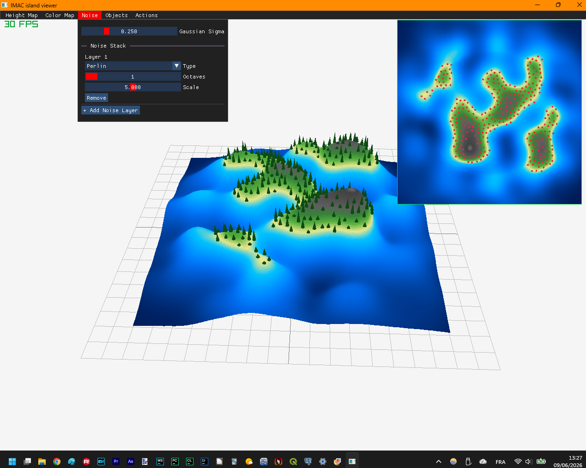 | 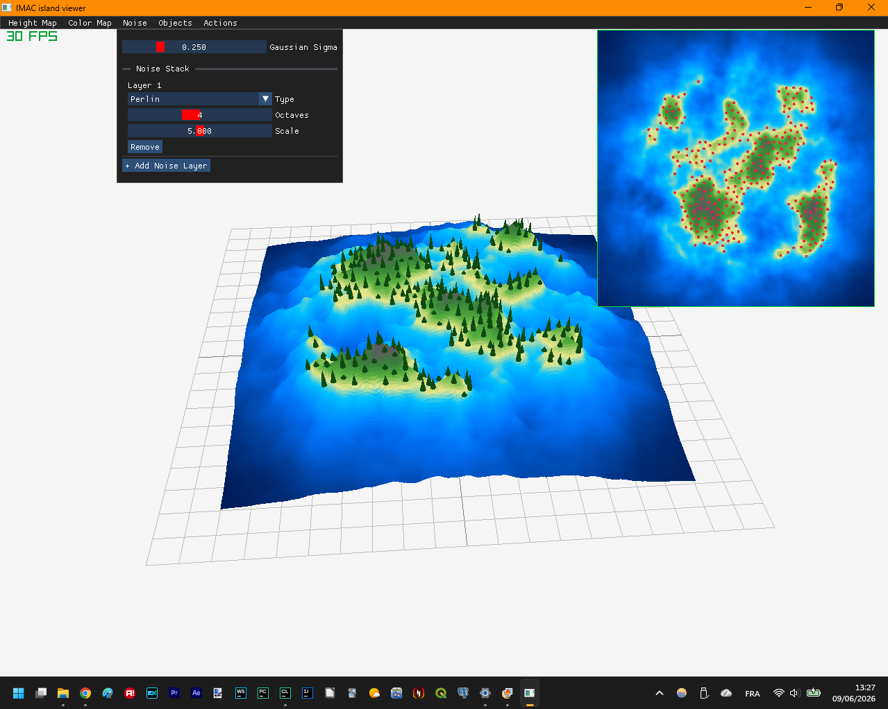 |  |

Pour observer cette différence dans l'interface :

1. Dans le menu Height Map -> désactiver Random Seed
2. Dans le menu Noise -> faire varier le nombre d'octaves
3. Dans Actions -> cliquer sur "Regenerate All"

## Poisson disk sampling

La taille de notre carte varie de 0 à 1 selon notre code, contrairement au code des vidéos partagé dans le sujet du rapport ou des articles trouvables sur internet.<br>
De ce fait, le paramètre radio "params.poissonRadius" par exemple ne peut pas être de 1 puisqu'il indique le rayon entre les points (pour résumer, dans les faits, ce n'est pas exactement ça).

La valeur 0,2 a été retenue comme compromis afin d'éviter des points trop proches tout en conservant un nombre suffisant de points.

| radius = 1                                | radius = 0.2                                |
| ----------------------------------------- | ------------------------------------------- |
|  |  |

Dans [la vidéo de Sebastian League](https://www.youtube.com/watch?v=7WcmyxyFO7o), la variable `sampleRegionSize` correspond à la taille de la zone.
Dans cette implémentation, la taille de la carte est normalisée à 1.

# VI - Difficultés et solutions

## Le Simplex qui fonctionnait mal

### Le problème

Le code de Simplex Noise a été repris de l'article [Simplex noise demystified](https://www.researchgate.net/publication/216813608_Simplex_noise_demystified).
Après adaptation, le bruit se répétait en boucle.


### La solution

Le problème provenait d'une initialisation manquante de la liste de 512 permutations. Une fois ce point corrigé, le bruit cessa de se répéter.

## Les objets qui se déplaçaient aléatoirement

### Le problème

Le placement des objets était recalculé à chaque frame, car la fonction d'aléatoire `randF` était appelée pendant le rendu.


### La solution

Les données aléatoires de placement ont été stockées dans une liste de `ObjectRandomizationData` disponible dans le `context` de l'application.
Cette structure contient les offsets de position et de rotation pour chaque objet, ce qui permet de réutiliser les mêmes valeurs à chaque frame.

## Interface ergonomique

### Le problème

L'interface initiale affichait tous les contrôles dans une seule fenêtre, ce qui devenait difficile à lire.
La pile de bruit ajoutait de nombreuses lignes et alourdissait la lisibilité.

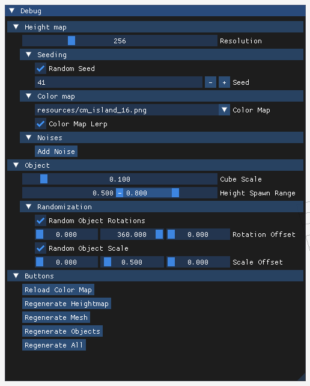

### La solution

L'interface a été réorganisée en sous-menus, avec des codes couleur et des sections dédiées à chaque catégorie de paramètres.

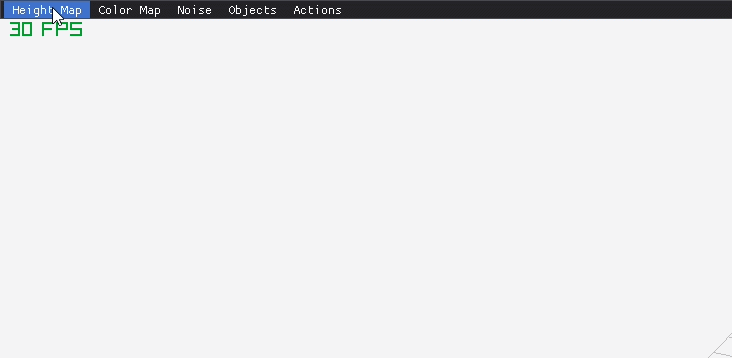

## L'échec du Diamond Square et des bruits matriciels

Le code de l'échec se trouve dans la branche [diamond-square-attempt](https://github.com/NilsMT/imac-algo-s2-island-viewer/tree/diamond-square-attempt).

### Avant

La noise stack traitait chaque bruit comme une fonction prenant une position et une seed, et renvoyant un float.

```cpp
struct Noise {
    std::function<float(glm::vec2 const&, int)> func;
    int nbOctave {6};
    float scale {5.f};
};

struct ImageGenerationData {
    ...
    static std::function<float(glm::vec2 const&, int)> noiseFunctions[2];
};

struct ImageGenerationParameters {
    ...
    std::vector<Noise> noiseStack {};
};
```

### Le problème

Le Diamond Square est un algorithme **matriciel** : il génère une heightmap entière (`Image`) d'un coup, plutôt que de renvoyer une valeur par position comme `Perlin` et `Simplex`. Il fallait donc supporter deux types de bruits dans la même stack :

- **Fonction** : `float(glm::vec2, int)`, point par point (Simplex, Perlin...)
- **Matrice** : `Image( params de l'algo )`, qu'on sample ensuite (mais chaque algo matriciel peut avoir une signature entrante différente)

### La solution

Un `std::variant` a été utilisé pour conserver une structure `Noise` unique, en distinguant le type via `NoiseType`.

```cpp
enum NoiseType {
    FUNCTION,
    MATRIX,
};

using NoiseFunction = std::variant
    std::function<float(glm::vec2 const&, int)>, // PERLIN + SIMPLEX
    std::function<Image(float)>                  // DS
    //les autres algo matrice de type "Image( leurs paramètres )"
>;

struct Noise {
    NoiseType type;
    NoiseFunction func;
    int nbOctave {2};
    float scale {5.f};
};

struct ImageGenerationData {
    ...
    static std::variant
        std::function<float(glm::vec2 const&, int)>,
        std::function<Image(float)>
    > noiseFunctions[3];
    const NoiseType noiseFunctionsTypes[2] = {
        NoiseType::FUNCTION,
        NoiseType::MATRIX
    };
};

struct ImageGenerationParameters {
    ...
    std::vector<Noise> noiseStack {};
};

struct App {
    ...
    std::vector<Image> noiseMatrixStack {}; // résultats des algos matriciels
    ...
};
```

### Problèmes résultant

- Le variant ne peut pas couvrir toutes les signatures possibles des algos matriciels : il faudrait ajouter à la main chaque nouvelle signature dans `NoiseFunction`
- Il faut jongler avec `std::get` / `std::get_if` partout où on utilise un bruit
- L'interface ImGui doit s'adapter manuellement à chaque type de bruit (ou alors on s'adapte à la signature de la fonction de bruit matriciel)
- Une `noiseMatrixStack` séparée dans `AppContext` stocke les résultats des algos matriciels, ce qui crée une désynchronisation potentielle avec la `noiseStack`
    > une option plus simple aurait été de générer la matrice pour chaque position au lieu de tout stocker une fois, mais niveau performance c'est catastrophique

## Poisson Disk Sampling

Le poisson disk sampling a été complexe pour moi (Matthieu) à implémenter

### Le 1er problème

Mon principal problème était un temps d'exécution très long et le fait de ne pas savoir si l'algorithme fonctionnait bien.
Mais ce problème était lié au fait que je n'implémentais pas la version de Bridson's, je voulais aller vite et que j'avais mal appréhendé le problème.

### La 1ère solution

L'une des premières pistes était de demander de l'aide au chargé de TD, notamment pour me réexpliquer certains points de l'algorithme (tel qu'afficher les points candidats
de manière cyclique autour du point actif et non dans un carré), de regarder des versions d'algorithme dans d'autres langages, mais surtout de reconstruire l'algorithme étape par étape.

Reconstruire étape par étape c'était ce que faisait The Coding Train dans sa vidéo :

- J'ai commencé à afficher un point aléatoire sur la carte
- Affiché les points candidats autour de ce point
    - Ici, je me suis aperçus que l'un des pourquoi cela ne marchait pas, c'était le radius trop grand. Cela m'a permis de réajuster la valeur de la variable proprement.

J'ai ainsi pu constater le bon fonctionnement de l'algorithme à ce stade, et continuer progressivement.

### Le 2ème problème

Parce que je n'utilisais pas la version de Bridson, plutôt que de m'aider d'un tableau pour comparer un point candidat avec les points périphérie,
je comparais le point candidat avec TOUS les points de la carte en parcourant une liste.

A petite échelle, ça allait, à grande échelle, cela prenait tellement de temps, que je pouvais difficilement constater le résultat.

### La 2ème solution

Et donc, remplacer ma liste par un tableau où les points d'une certaine zone se retrouve dans une même case.

Si on constate que la case du tableau associé à notre zone comporte déjà un point (car marqué 0 et non plus -1 (-1 signifiant que c'est vide)),
nous ne pouvons pas placer notre point candidat (la zone est déjà occupé).

C'est plus complexe à mettre en place, mais l'autre méthode n'était viable.

### Le 3ème problème

Avec la version de Bridson, je manipule un tableau (donc on utilise x et y), mais également des points sur la carte (on utilise aussi des x et y),
et on compare des points sur la carte, dans les listes, dans le tableau, en d'autre terme, il y a plusieurs x et y dans l'algorithme, mais chacune ont un rôle différent.

De ce fait, il est très simple de confondre des variables notamment quand on regarde le code de quelqu'un d'autres (articles sur internet ou vidéos sur internet).

### La 3ème solution

La solution a été de donner des noms de variable explicite comme `candidatGrilleX`, d'utiliser directement `pointCandidat.x` sans les stockés dans des variables,
mais aussi et surtout, de commenter un maximum. C'est-à-dire, ce que ça représente, à quoi cela correspond, même si cela peut paraître évident.

Parce qu'il est beaucoup trop facile de comprendre une partie évidente de l'algorithme, et d'avoir un doute.
Alors le fait de commenter même les évidences, c'est un moyen d'être sûr d'avoir tout en tête pour bien comprendre ce que l'on fait.

# VII - Captures d'écrans comparatives

Aucune capture supplémentaire pertinente n'est disponible en dehors de celles déjà présentes dans ce rapport.
Les images sont toutes disponibles dans [img/comparisons/](./img/comparisons/) avec des noms de la forme `<critère>_<valeur>` ou `<with|no>_<critère>`

> Comme `with_lerp` et `no_lerp` ou `menu_old` et `menu_new`

# VIII - Post-mortem

## Les problèmes et les résolutions

Le projet a rencontré plusieurs difficultés techniques.
Les solutions ont été trouvées par des recherches, des échanges avec le chargé de TD et des discussions internes.

## Avec plus de temps

Avec plus de temps, en témoigne la liste de tâches, nous aurions pu implémenter un outil de création de color map plutôt que de charger une image, et ce avec [imgui_gradient](https://github.com/Coollab-Art/imgui_gradient) de Coollab.

Nous aurions pu faire comme dans Minecraft et mettre des biomes selon un set d'objets 3D, une color map, et placés selon une carte de températures.

Nous aurions pu ajouter plus de bruits, pour avoir des formes d'îles en croissant, donut, carrés...

Et avec **ÉNORMÉMENT** de temps et de détermination, reproduire [WorldBox](https://www.superworldbox.com/) en 3D (il faut savoir être ambitieux dans la vie).

## Répartition du travail

La répartition a été faite de sorte à ce que les choses déjà manipulées par Nils pendant le workshop de prog algo (avec le Diamond Square) et le [Workshop d'esthétique et algorithmique](https://imac-wk-esthe-et-algo.vercel.app/src/free/island/index.html) soient faites par lui pour garantir une efficacité sur le reste du projet. Matthieu a été le plus en charge des fonctionnalités nécessaires du projet (çàd la base) pour garantir un code compréhensible.

Pendant ce temps Nils faisait aussi des bonus sur des choses plus complexes et expérimentales (comme l'échec cuisant du Diamond Square).

Cela correspondait bien aux deux membres car les charges de travail sur les autres projets n'étaient pas les mêmes pour l'un et l'autre.
