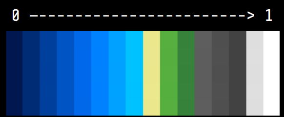
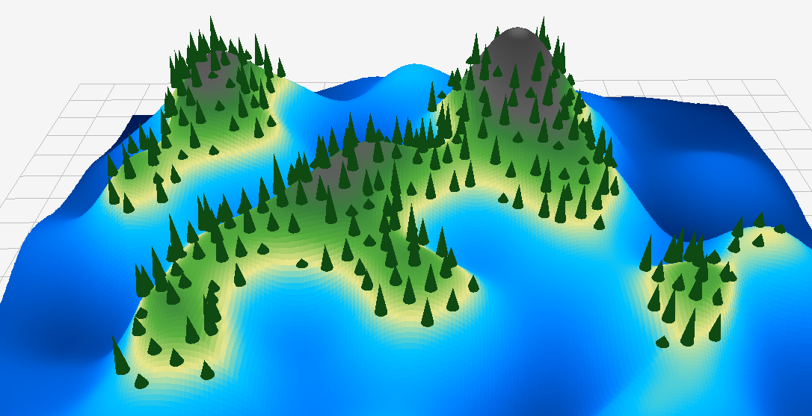
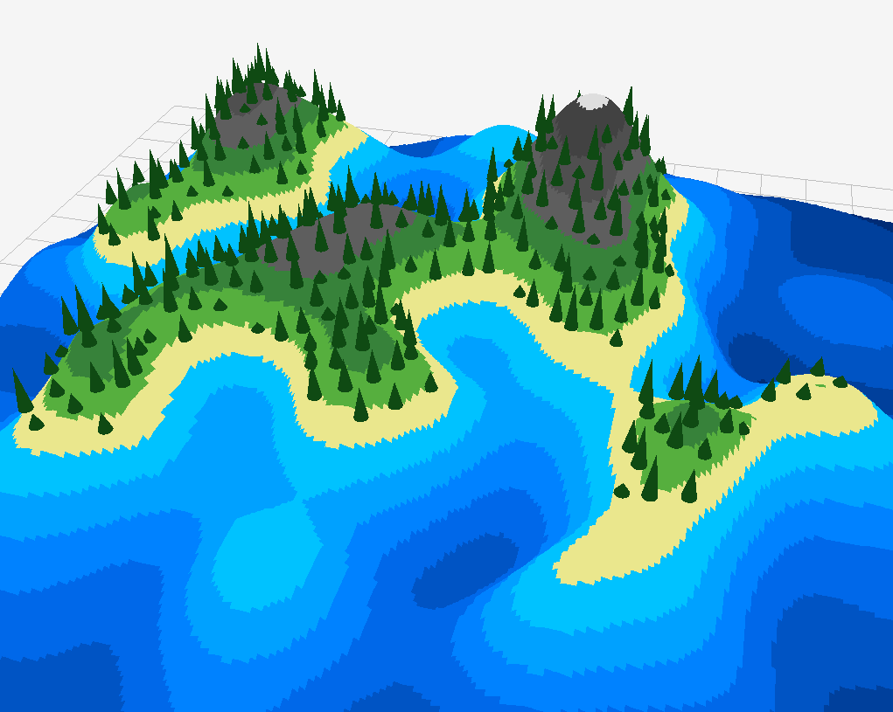
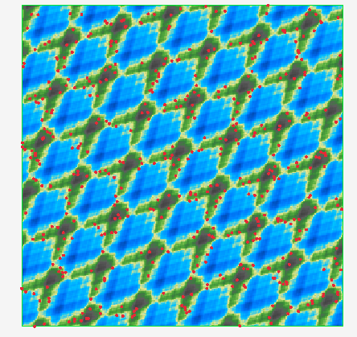

Le rapport doit contenir :

- sous quelle plateforme vous avez développé le projet (Linux, Windows, macOS)
- les choix algorithmiques faits
- les paramètres retenus et leur impact visuel
- les difficultés rencontrées et solutions
- quelques captures d'écran comparatives

Ajoutez enfin une partie "Post mortem" pour analyser le travail fourni :

- qu'est-ce qui a bien fonctionné, quels ont été les problèmes rencontrés
- comment vous les avez surmontés, et ce que vous auriez fait différemment.
- Avec plus de temps, qu'est-ce que vous pourriez ajouter ?
- Comment s'est passée la répartition du travail dans le groupe ?

Le rapport doit être concis (par exemple 2 à 5 pages sans les illustrations).

# Sommaire

- [Sommaire](#sommaire)
- [Plateforme et structures](#plateforme-et-structures)
- [Liste des tâches](#liste-des-tâches)
- [Informations supplémentaires](#informations-supplémentaires)
- [Rapport](#rapport)
    - [Choix algorithmiques](#choix-algorithmiques)
        - [Color map](#color-map)
        - [Masque](#masque)
        - [ImGui local](#imgui-local)
    - [Paramètres et impact visuel](#paramètres-et-impact-visuel)
        - [Color map](#color-map-1)
        - [Aléatoire](#aléatoire)
        - [Intervalle de spawn](#intervalle-de-spawn)
    - [Difficultés et solutions](#difficultés-et-solutions)
        - [Le Simplex qui marchait pas](#le-simplex-qui-marchait-pas)
            - [Le problème](#le-problème)
            - [La solution](#la-solution)
        - [Les objets qui font n'importe quoi](#les-objets-qui-font-nimporte-quoi)
            - [Le problème](#le-problème-1)
            - [La solution](#la-solution-1)
        - [L'interface pas ergonomique](#linterface-pas-ergonomique)
            - [Le problème](#le-problème-2)
            - [Solution](#solution)
        - [L'échec de l'ajout du Diamond Square (et des bruits matriciels)](#léchec-de-lajout-du-diamond-square-et-des-bruits-matriciels)
            - [Avant](#avant)
            - [Le problème](#le-problème-3)
            - [Ce qu'on a fait](#ce-quon-a-fait)
            - [Pourquoi c'est pas idéal](#pourquoi-cest-pas-idéal)
    - [Captures d'écrans comparatives](#captures-décrans-comparatives)
    - [Post-mortem](#post-mortem)
        - [Les problèmes et les résolutions](#les-problèmes-et-les-résolutions)
        - [Avec plus de temps](#avec-plus-de-temps)
        - [Répartition du travail](#répartition-du-travail)

# Plateforme et structures

Le projet a été développé sur Windows

```
├─── 📁 bin : exécutables
├─── 📁 build : fichiers de compilation
├─── 📁 img : images du rapport
├─── 📁 imgui : librairie d'interface, en local
├─── 📁 resources : ressources, comme les images de color map
└─── 📁 src : code source
    ├─── 📁 utils : dossier avec les utilitaires
    ├─── 📄 app : fichiers avec les paramètres de l'application
    ├─── 📄 draw : fichiers de rendu d'interfaces et de la carte
    ├─── 📄 generation : fichiers de génération du terrain et des objets
    ├─── 📄 main.cpp : fichier d'exécution principal
    └─── 📄 noise : fichiers pour la génération des bruits
```

# Liste des tâches

> 🚧 : En cours ✅ : Fini ❌ : À faire
> ♒ : Amélioration supplémentaire ☑️ : Amélioration de l'énoncé

| Fait | Catégorie | En + | Tâche                                                               | Note | Qui      |
| ---- | --------- | ---- | ------------------------------------------------------------------- | ---- | -------- |
| ✅   | -         |      | Bruit fractal (FBM)                                                 |      | Matthieu |
| ✅   | -         |      | Générer heightmap + couleur                                         |      | Nils     |
| ✅   | -         |      | Poisson disk sampling (2D) + placement en 3D                        |      | Matthieu |
| ✅   | 🖥️ IHM    |      | Regénérer la heightmap                                              |      | Nils     |
| ✅   | 🖥️ IHM    |      | Regénérer le mesh 3D                                                |      | Nils     |
| ✅   | 🖥️ IHM    |      | Regénérer le poisson disk sampling                                  |      | Matthieu |
| ✅   | 🖥️ IHM    |      | Paramètres (seed, size, height range)                               |      | Nils     |
| ❌   | -         | ☑️   | Colormap builder                                                    |      | -        |
| ❌   | -         | ☑️   | Coloration avancé (ex: en fonction de la pente, type de biome, etc) |      | -        |
| ✅   | -         | ☑️   | Algorithmes différents bruit (Simplex, Worley, etc)                 |      | Nils     |
| ✅   | -         | ☑️   | Pile d'Algorithmes de bruit                                         |      | Nils     |
| ✅   | -         | ☑️   | Variation placement d'objet (taille, rotation)                      |      | Nils     |
| ✅   | -         | ☑️   | Placement d'objet avec des conditions (pentes, hauteur)             |      | Nils     |
| ❌   | -         | ☑️   | Importer un modèle 3D (libre de droits) à la place du cube          |      | -        |
| ❌   | -         | ☑️   | Liste de modèles 3D (libre de droits) à placer avec conditions      |      | -        |
| ❌   | -         | ☑️   | Biomes (colormap, liste d'objets, influence sur la hauteur, bruit)  |      | -        |
| ❌   | -         | ☑️   | Connecter les îles avec des ponts, ou par la terre                  |      | -        |
| ❌   | -         | ☑️   | Génération de différentes formes d'îles (au moins 3)                |      | -        |

# Informations supplémentaires

> Extension pratique pour naviguer dans des endroits du code sur `VS Code` :<br>
> [Todo Tree](https://marketplace.visualstudio.com/items?itemName=Gruntfuggly.todo-tree)<br>
> Avec `NOTE:` et `SOURCE:` d'ajoutée dans [todo-tree.general.tags](vscode://settings/todo-tree.general.tags)
>
> Il est aussi recommandé d'utiliser l'`Outline` dans le panneau de droite de `VS Code`

> Il y a des fichiers qui ont des indentations bizarres à cause d'un formatage qui s'est mal passé (en faisant Ctrl + P et puis format document)

# Rapport

## Choix algorithmiques

### Color map

Pour la coloration de la carte, j'ai (Nils) décidé de faire une color map (palette de coloration) d'après une image comme j'avais fait pour le [⭐⭐⭐⭐⭐⭐ Diamond Square](https://github.com/NilsMT/imac-wk-prog-algo-1/blob/main/EXOS.md#-diamond-square) pendant le Workshop de Prog Algo 1 qui mappe une valeur de la heightmap (0-1) à un pixel de la color map :



avec une interpolation linéaire (qui peut se désactiver) si la valeur ne correspond pas parfaitement à un pixel

Avec lerp



Sans lerp



### Masque

Un masque sélectionnable a été choisi pour générer une île de manière personnalisable, le meilleur masque restant quand même Gaussien (pour avoir une forme circulaire)

Cela a été décidé car nous avions plusieurs bruits à disposition alors pourquoi pas en faire une fonctionnalité pour à la fois la pile de bruit et le masque.

Bien que cela ne soit que très peu utile

### ImGui local

La librairie ImGui est stocké en local car, il y avait besoin d'un objet d'interface [slider-range2](https://github.com/Entrpi/imgui/tree/feature/slider-range2) qui n'était pas disponible mais déjà développé par quelqu'un.

La conséquence c'est que le projet est un poil plus gros sur GitHub

(PS: le fetch-content dans le CMake ne marchait pas sur ce repo pour une raison obscure)

## Paramètres et impact visuel

### Color map

Comme dit précédement, il a été choisi de permettre une sélection de la palette de couleur de la carte (et il est facile d'en ajouter une) pour avoir plusieurs types de "biomes"

### Aléatoire

Il a été décidé d'ajouter des paramètres sur le placement aléatoire des objets pour faire varier la taille et l'orientation pour avoir de la variation sur les objets, et avoir un rendu plus proche de la vie réelle (c'est-à-dire les arbres ne sont pas tous de la même taille)

### Intervalle de spawn

Un intervalle de hauteur de spawn autorisé a été codé pour permettre une condition de placement pour, par exemple, éviter d'avoir des objets trop haut dans les montagnes, ou dans la mer.

## Difficultés et solutions

### Le Simplex qui marchait pas

#### Le problème

Pour le Simplex Noise, nous avons repris le code de l'article [Simplex noise demystified](https://www.researchgate.net/publication/216813608_Simplex_noise_demystified)

Cependant après avoir adapté le code, il y avait un problème : le bruit se répétait en boucle



#### La solution

Après avoir crié à l'aide au chargé de TD, qui n'a pas trouvé la solution car le code était une exacte copie de ce que l'article avait,
la solution était toute simple, malgré des heures de tirage de cheveux : le code n'initialisait pas la liste de permutations (ce qui fait en sorte que le bruit est un bruit)

### Les objets qui font n'importe quoi

#### Le problème

à un moment du projet, le placement des objets pouvait être aléatoire. Cependant ces valeurs aléatoires changeaient à chaque frame car la fonction d'aléatoire `randF` était appelée pendant le rendu.


#### La solution

À la construction de la carte et du placement des points, les données aléatoires de placement ont été stockées dans une liste de `ObjectRandomizationData` disponible dans le `context` de l'application. Cette structure contient la modification de la position et la rotation de base de l'objet, pour chacun. Résultat : on récupère la donnée générée et stockée bien avant, ce qui ne la change pas à chaque frame.

### L'interface pas ergonomique

#### Le problème

Avant, il y avait uniquement une fenêtre avec tous les morceaux d'interface listés dedans, un peu séparés les uns des autres mais rien de vraiment visible. Et à mesure que le projet progressait il y avait beaucoup de choses.
D'autant plus qu'il y avait la pile de bruit à gérer qui ajoutait beaucoup de lignes


#### Solution

Il a donc été décidé de refaire l'interface sous forme de sous-menus avec des couleurs différentes et des sections propres à chaque catégorie de paramètres


### L'échec de l'ajout du Diamond Square (et des bruits matriciels)

Le code de l'échec est dans la branche [diamond-square-attempt](https://github.com/NilsMT/imac-algo-s2-island-viewer/tree/diamond-square-attempt)

#### Avant

La noise stack était simple : chaque bruit est une fonction qui prend une position et une seed, et renvoie un float.

```cpp
struct Noise {
    std::function<float(glm::vec2 const&, int)> func;
    int nbOctave {6};
    float scale {5.f};
};

struct ImageGenerationData {
    ...
    static std::function<float(glm::vec2 const&, int)> noiseFunctions[2];
};

struct ImageGenerationParameters {
    ...
    std::vector<Noise> noiseStack {};
};
```

#### Le problème

Le Diamond Square est un algorithme **matriciel** : il génère une heightmap entière (`Image`) d'un coup, plutôt que de renvoyer une valeur par position comme `Perlin` et `Simplex`. Il fallait donc supporter deux types de bruits dans la même stack :

- **Fonction** : `float(glm::vec2, int)`, point par point (Simplex, Perlin...)
- **Matrice** : `Image( params de l'algo )`, qu'on sample ensuite (mais chaque algo matriciel peut avoir une signature entrante différente)

#### Ce qu'on a fait

Pour garder une struct `Noise` unique, on a utilisé un `std::variant` pour le champ `func`, avec une enum `NoiseType` pour savoir lequel des deux types est actif.

```cpp
enum NoiseType {
    FUNCTION,
    MATRIX,
};

using NoiseFunction = std::variant
    std::function<float(glm::vec2 const&, int)>, // PERLIN + SIMPLEX
    std::function<Image(float)>                  // DS
    //les autres algo matrice de type Image( leurs paramètres )
>;

struct Noise {
    NoiseType type;
    NoiseFunction func;
    int nbOctave {2};
    float scale {5.f};
};

struct ImageGenerationData {
    ...
    static std::variant
        std::function<float(glm::vec2 const&, int)>,
        std::function<Image(float)>
    > noiseFunctions[3];
    const NoiseType noiseFunctionsTypes[2] = {
        NoiseType::FUNCTION,
        NoiseType::MATRIX
    };
};

struct ImageGenerationParameters {
    ...
    std::vector<Noise> noiseStack {};
};

struct App {
    ...
    std::vector<Image> noiseMatrixStack {}; // résultats des algos matriciels
    ...
};
```

#### Pourquoi c'est pas idéal

- Le variant ne peut pas couvrir toutes les signatures possibles des algos matriciels : il faudrait ajouter à la main chaque nouvelle signature dans `NoiseFunction`
- Il faut jongler avec `std::get` / `std::get_if` partout où on utilise un bruit
- L'interface ImGui doit s'adapter manuellement à chaque type de bruit (ou alors on s'adapte à la signature de la fonction de bruit matriciel)
- Une `noiseMatrixStack` séparée dans `AppContext` stocke les résultats des algos matriciels, ce qui crée une désynchronisation potentielle avec la `noiseStack`
    > une option plus simple aurait été de générer la matrice pour chaque position au lieu de tout stocker une fois, mais niveau performance c'est catastrophique

## Captures d'écrans comparatives

## Post-mortem

- qu'est-ce qui a bien fonctionné, quels ont été les problèmes rencontrés ✅
- comment vous les avez surmontés, et ce que vous auriez fait différemment.✅
- Avec plus de temps, qu'est-ce que vous pourriez ajouter ? ✅
- Comment s'est passée la répartition du travail dans le groupe ? ✅

### Les problèmes et les résolutions

Les problèmes ont été rencontrés sur plusieurs parties du projet, et avec une complexité différente.
La plupart du temps, la solution était trouvée grâce à internet, notre cerveau, grâce au chargé de TD ou en message privé avec le chargé de projet (🫵 toi).

### Avec plus de temps

Avec plus de temps, en témoigne la liste de tâches, nous aurions pu implémenter un outil de création de color map plutôt que de charger une image, et ce avec [imgui_gradient](https://github.com/Coollab-Art/imgui_gradient) de Coollab

Nous aurions pu faire comme dans Minecraft et mettre des biomes selon un set d'objets 3D, une color map, et placés selon une carte de températures

Nous aurions pu ajouter plus de bruits, pour avoir des formes d'îles comme un croissant, un donut, des carrés, etc...

Et avec **ÉNORMÉMENT** de temps et de détermination, reproduire [WorldBox](https://www.superworldbox.com/) en 3D (il faut savoir être ambitieux dans la vie)

### Répartition du travail

La répartition a été faite de sorte à ce que les choses déjà manipulées par Nils pendant le workshop de prog algo (avec le Diamond Square) et le [Workshop d'esthétique et algorithmique](https://imac-wk-esthe-et-algo.vercel.app/src/free/island/index.html) soient faites par lui pour garantir une efficacité sur le reste du projet. Matthieu a été le plus en charge des fonctionnalités nécessaires du projet (çàd la base) pour garantir un code compréhensible.

Pendant ce temps Nils faisait aussi des bonus sur des choses plus complexes et expérimentales (comme l'échec cuisant du Diamond Square).

Cela correspondait bien aux deux membres car les charges de travail sur les autres projets n'étaient pas les mêmes pour l'un et l'autre
